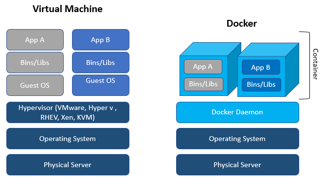
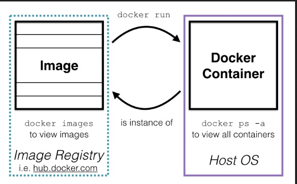

<h1 align="Center">Basic Practical Docker and Containerization</h1>

## What is Docker?

[Referece Photo Link](Ref:https://www.accenture.com/us-en/blogs/software-engineering-blog/shinde-docker-containerization-devops)



## Docker images VS Container



## Install Docker and skopeo on Linux
`sudo apt install docker.io`

`sudo apt install skopeo`

## Enable Docker on linux
`sudo systemctl enable docker --now`

## You can now get started with using docker, with sudo. If you want to add yourself to the docker group to use docker without sudo, an additional step is needed:???

`sudo usermod -aG docker $USER`

# Essential Command

>### Searching Docker image from Repository (DockerHub)
>`sudo docker search imageName` 

>### Pulling (Downloading) images to local Computer
>`sudo docker pull imageName`

>### How to look local images
>`sudo docker images`
>
>### How to inspect Local image (Show image detail infromation)
>`sudo docker inspect ImageID`
>
>### How to inspect remote registory images
>`skopeo inspect docker://mysql`


## How to run local container images
```
sudo docker images
sudo docker run imageid
```
## How to find running container (Docker see container as process)

`sudo docker ps`

`sudo docker container ls`

## How to find all container (including not running container)
`sudo docker ps -a`

## How to save docker image in local computer (.tar format)

`docker save imagesID > ImageName.tar`

## How to remove docker container

 `sudo docker rm containerID or Name`

## How to remove docker images

`sudo docker rmi imageID or Name`

## Checking Docker Resource Usage

`sudo docker stats`

<h1 align="Center"> Container Mangement with Portainer (Web App)</h1>

## Install portainer docker file

`docker search portainer`

`docker pull portainer/portainer-ce`


## Run portainer docker file


`docker run --name portainer -p 9000:9000 -v "/var/run/docker.sock:/var/run/docker.sock"`

### Notes
> * you can use my portianer script to run portainer
> * please disconnect VPN otherwise localhost did not work 
> * you can use docker ip and port instead of localhost and local port
