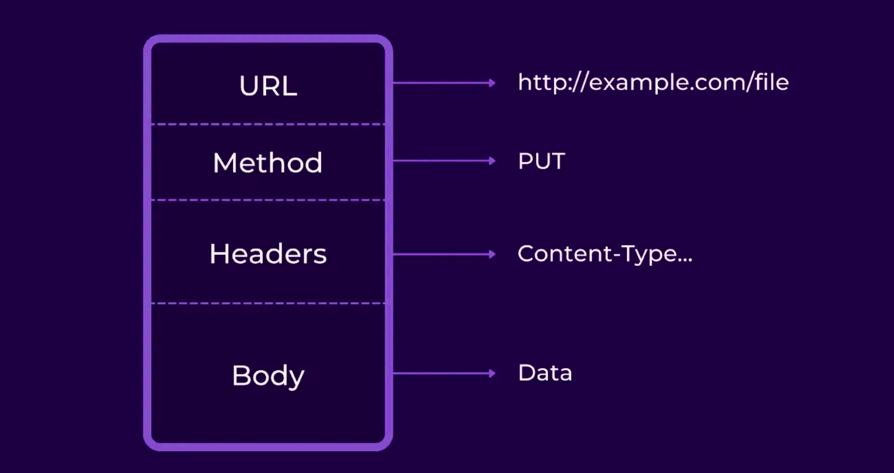
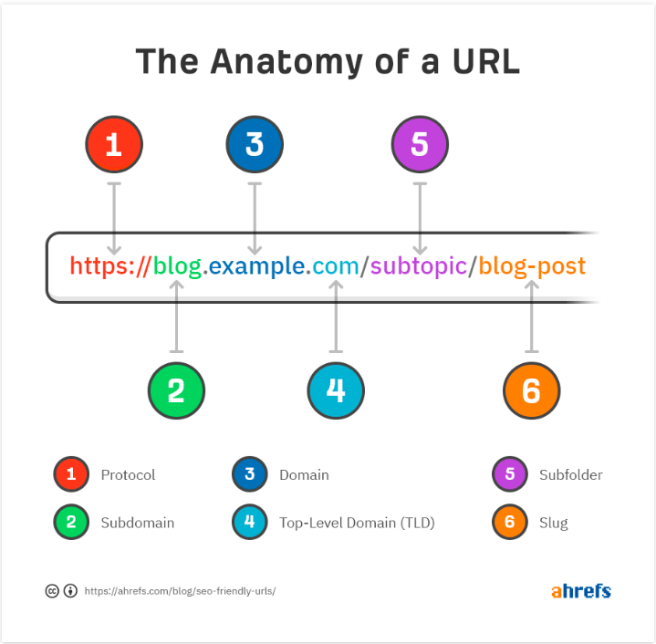
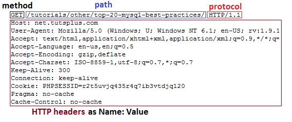

# Web Technologies

## Web Application

- `Web Application` is web-based softwared that performs actions (function) based on `user input` and usually interacts with a`backend systems`

## Web Server
- Softwares running on the operation system of a server tha allow connections to access a web Application.

## Web Server Root Directory

- Window 
`C:\Inetpub\wwwroot`

- Linux

`/var/www`

	- `var`: This directory includes the files for databases, system logs, and the source code for web application itself!

## HTTP

#[photo_reference](https://medium.com/sina-ahmadi/java-http-server-616797710f54)

- `Hypertext Transfer Protocol`

- HTTP use message-based model
- Client send request message and server send response message

## HTTP sturcutre

#### URL (Uniform Resource Locator)

- Unique Address for a `Resource` on server
- `Resource` = phto, file, personal prfiles, data, etc..

[Photo_Reference](https://ahrefs.com/blog/seo-friendly-urls)

#### Method

- The method tells the server what kind of action the client wants

`GET` — used to retrieve or read a resource. If successful, the response will contain the resource specified in the URL. APIs mainly deal in JSOn and XML files. ** GET Request do not have message body **

`POST` — used to create new resources, including subordinate resources to already existing nouns. A successful response will contain the URL of the newly created resource.

`PUT` — used to update an existing resource. The request will also contain the new information that should replace the existing one in the resource.

`PATCH` — like PUT, updates an existing resource, but differently. Instead of sending the new data, it sends instructions on how to modify the current resource.

`DELETE` — used to, as the name suggests, delete a resource.

## HTTP Header

[photo_reference](https://code.tutsplus.com/tutorials/http-headers-for-dummies--net-8039)

- `key: value`

#### `Host` Header 
- Specify the host name that appear in full URL	
- This is necessary when multiple websit are hosted on the same server 

#### `Content-Length` Header

- Value is the length of the response body in `bytes`
- It is helpful to hacker to decipher the applicaiton response to input  (escepially brute-force attacks)

#### `Location` Header 

- This Header is used when applicaiton redirect a user to a new page

#### `cookie` Header

- `cookie` - a small piece of data from website or web server that stored within user computer by web browser. 
- They can also be used to save for subsequent use information that the user previously entered into form fields, such as names, addresses, passwords, and payment card numbers.

- This Header send cookie back to the server to maintain user's session

- ** This cookie provide valid session and it can be use in attacks against other application users **

#### Referrer Header

- This header list the webpage that the user was previously on , `the last page visit`
