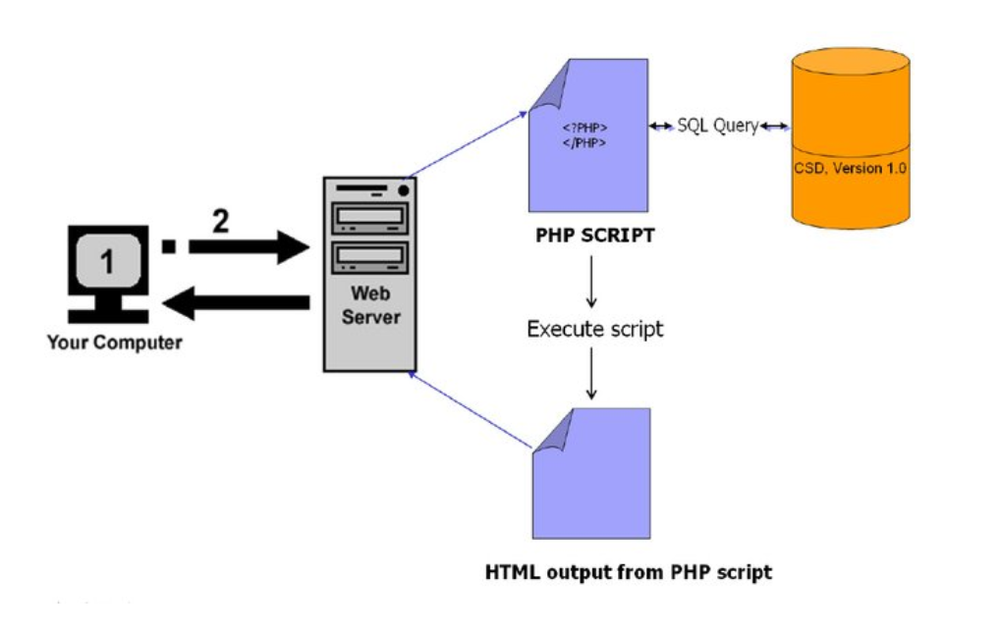
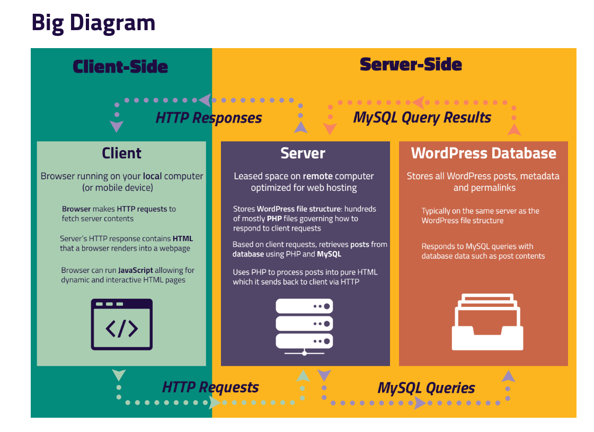
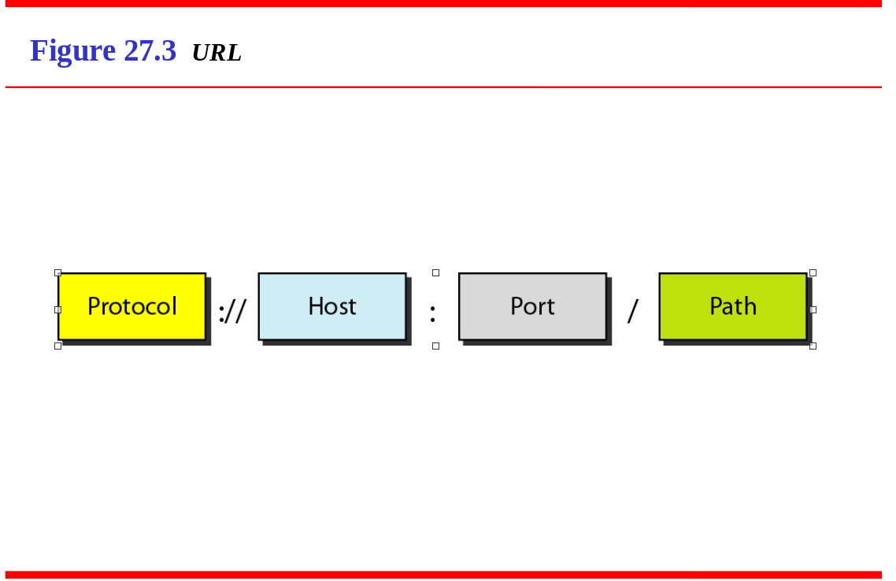

<h1 align="Center">How Website Work</h1>
 

# Web Architecture
 

 

# Client and server site  

## Client Side

1. Html
2. CSS
3. Java Script

## Server side

1. PHP
2. Python
3. MySQL
4. etc....

# URL (Uniform Resource Loactor)

## The uniform resource locator (URL) is a standard for specifying any kind of information on the Internet. 
## URL defines four things: 
* Protocol
* host computer
* Port
* path
 

# Eg
`https://www.google.com/photos/about/`

