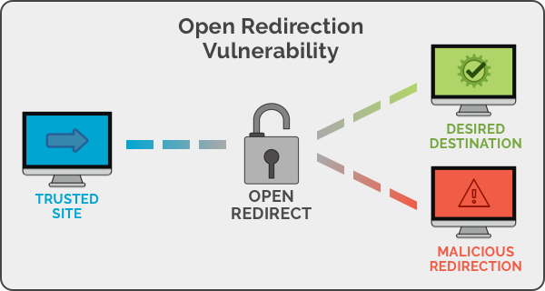
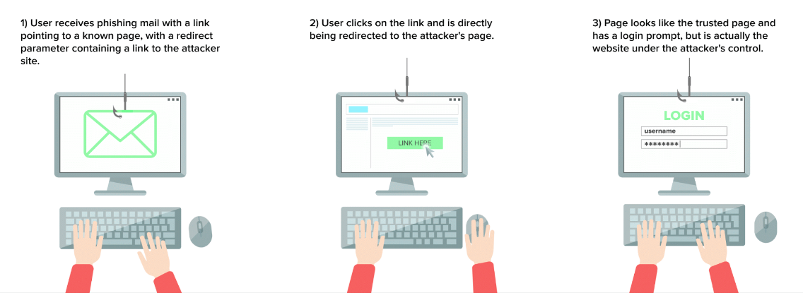
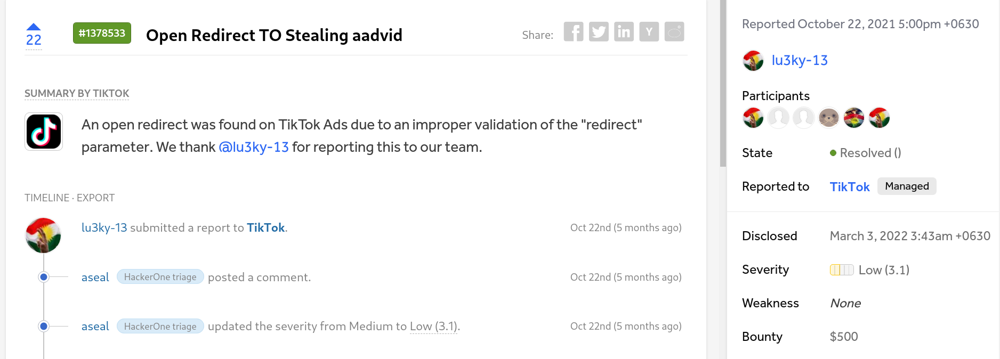
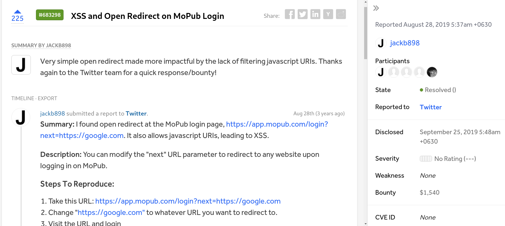
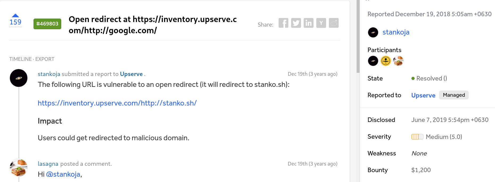

<h1 align="center">Open Redirection</h1>


## Definition

- redirection to an arbitrary external domain 
 (user can manipulate this redirect parameter)
 <br>

 - Open Redirect vulnerabilities don't get enough attention from developers because they don't directly damage website and do not allow an attacker to directly steal data that belong to the company

## Example url

+ ` http://example.com/example.php?url=http://malicious.example.com`

<br>




## How to Exploit

### 1. Phishing




### 2. Execute Java Scirpt (XSS attack)

- Rare in modern browser

- Example (not working now)
    +  `https://example.com/index.php?go=javascript:alert(document.cookie)`
    

## How to Prevent

- Remove the redirection function from the application, and replace links to it with direct links to the relevant target URLs 


- Not let the user contorl where your page redirects


- Warning the user
    + eg: `https://google.com/amp/bing.com`


## Major words use in redirect

```
url
RelayState
ReturnUrl
RedirectUri
Return
Return_url
Redirect
Redirect_uri
Redirect_url
RedirectUrl
Forward
ForwardUrl
Forward_URL
SuccessUrl
Redir
Exit_url
Destination
```


## Google Dorking For Open Redirection

```
allinurl:"<keyword>=https"
allinurl:"<keyword>=http"
allinurl:<keyword>=https
allinurl:<keyword>=http
allinurl:<keyword>%3Dhttps
allinurl:<keyword>%3Dhttps*
allinurl:<keyword>%253Dhttps
allinurl:<keyword>%253Dhttps*
allinurl:<keyword>%3Dhttp
allinurl:<keyword>%3Dhttp*
allinurl:<keyword>%253Dhttp
allinurl:<keyword>%253Dhttp*
allinurl:<keyword>
```

## Example Vulnerable Website


1. `http://educratsweb.com/`

+ ### vulnerable Parameter

  `http://educratsweb.com/l.php?url=https://scholarships.gov.in/fresh/newstdRegfrmInstruction`
`http://tapestry.click/Count.php?Link=https://www.oxy.edu/&Type=Org&ID=US-OCCDNT`


## Lab Link

`https://portswigger.net/web-security/ssrf/lab-ssrf-filter-bypass-via-open-redirection`


## Example Bounty Price




<br>



<br>




