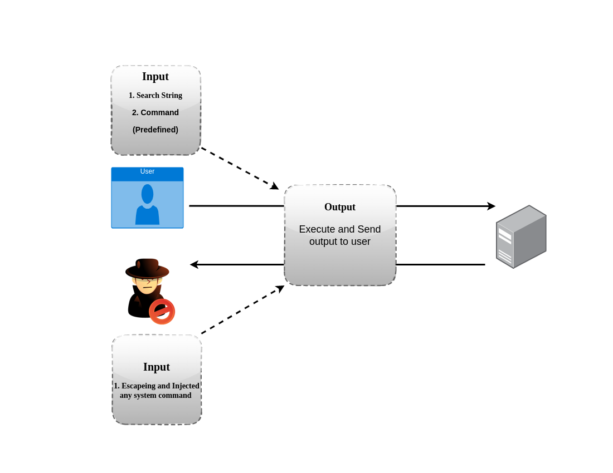

<h1 align="center">Command Injection Essential Theory</h1>

# Command Injection Definition

* Operating system command injection
vulnerabilities arise when an application
incorporates <strong> user-controllable data into a
command </strong> that is processed by a shell command
interpreter


# Theory for Command Injection



# Type of Command Injection

1. Result Based	(Output > Vsible)
2. Blind Based 	(Output > Not visible)	


# General Testing Process

### 1. Select Entry Point (Parameters)
### 2. Testing with Payload (delimiters)
### 3. Exploit
### 4. Mataining access


# Tools for Exploiting Command Injections
* commix (Command Injecction Exploiter)
* Example Usage
	- `python commix.py –url=”http://192.168.32.130/vulnerabilities/exec/`


# Command Parameters that can be consider for testing

```
cmd
exec
command
execute
ping
query
jump
code
reg
do
func
arg
option
load
process
step
read
function
req
feature
exe
module
payload
run
print
```


<h1 align="center">Links for this lecture</h1>

## My github Link

`https://github.com/Dr-404/WebHacking`

## Shell Link for exploit

`https://github.com/Dr-404/WebHacking/tree/main/shells/AlphaShell`


## Labs Link

`http://lab.awh.zdresearch.com/`


## Command Injection Payloads
```
https://github.com/fuzzdb-project/fuzzdb/blob/master/attack/os-cmd-execution/command-execution-unix.txt

```