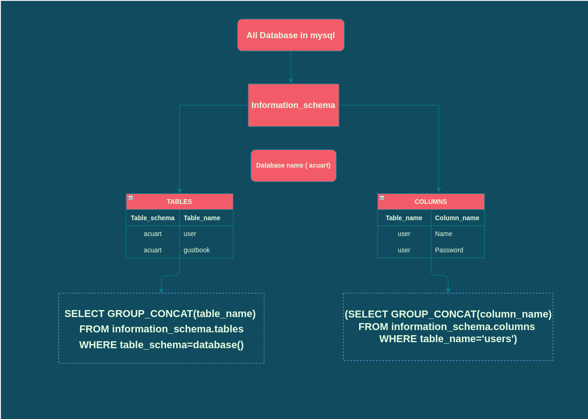

# How to find SQL Injection Vulnerability

## Methodology

1. Find parameter to inject
2. Identify the vulnerability
3. Enumerabe data from the database
4. Upload a backdoor


## 1. Finding Parameter

1. Intercept the proxy with burp and scan to obtain parameter  (identify all the data entry on the Web application)
2. Visit throughly web application 

#### Main Parameter of Injection


1. GET Parameter
2. POST Parameter
3. Cookes (usually used for authentication, session control)
4. Header (Host, Referer, User-Agent)


**Note**: <br>
<i>
The Host header field specifies the
Internet host and port number of the resource being requested. The Referer field specifies
the resource from which the current request was obtained. The User-Agent header field
determines the Web browser used by the user. Although these cases are uncommon, some network monitoring and Web trend applications use the Host, Referer, and User-Agent header
values to create graphs, for example, and store them in databases. In such cases, it is worth testing
those headers for potential injection vulnerabilities.</i>


## 2. Identify the vulnerability

1. Manipulating Parameters and  making application error

`http://testphp.vulnweb.com/listproducts.php?artist=1`

2. Identify error and type of database

Example Error

`You have an error in your SQL syntax; check the manual that corresponds to your MySQL server version for the right syntax to use near ‘‘VALUE’’.`


This Error Show
* Database Name = 'MySql'
* Exact syntax caused error = single quote
* Where error occured = after the parameter value
* 
## 3. Enumearting Database




## Finding Table Name

```
SELECT GROUP_CONCAT(table_name)
FROM information_schema.tables
WHERE table_schema=database()
```

## Finding Column Name

```
(SELECT GROUP_CONCAT(column_name)
FROM information_schema.columns 
WHERE table_name='users')
```