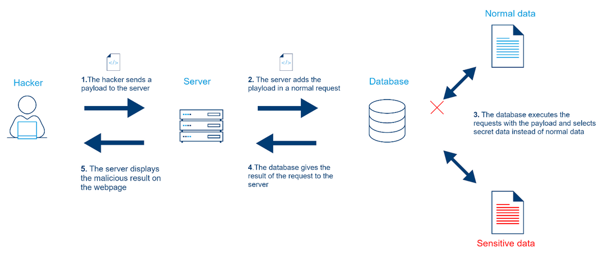
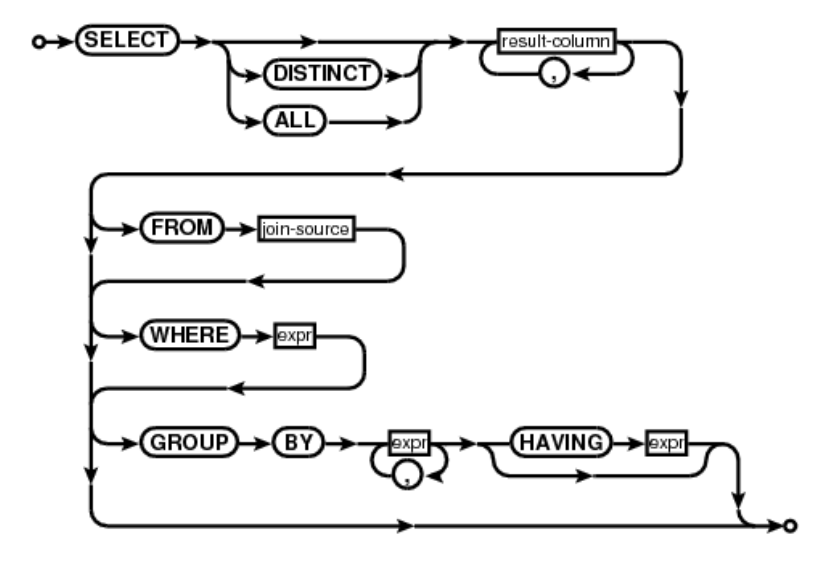

# SQL injection

## Definition

>A SQL injection is a technique that attackers use to gain unauthorized access to a web application database by adding a string of malicious code to a database query




photo credit to [orginal_Link](https://www.cloudprotector.com/sql-injection/)

<i> * To understand SQL injection you need to understand basic SQL query </i>

## SQL Basic

* Theree type of SQL Command
	- DDL: Data Definition Language
	- DCL: Data Control Language
	- DML: Data Maniputlation Language (mainly use)
	
## Data Manipulation language (DML)

#### CRUD operation

<table>
	<tr>
		<th> No </th>
		<th> CURD Operation </th>
		<th> SQL command </th>
	</tr>
	<tr>
		<td> 1 </td>
		<td>Create</td>
		<td>INSERT</td>
	</tr>
	<tr>
		<td> 2 </td>
		<td>READ</td>
		<td>SELECT</td>
	</tr>
	<tr>
		<td> 3 </td>
		<td>UPDATE</td>
		<td>UPDATE</td>
	</tr>
	<tr>
		<td> 4 </td>
		<td>DELETE</td>
		<td>DELETE</td>
	</tr>   


</table>

<strong>SELECT is the most using statement in SQL injection</strong>


## SQL language structure

** SELECT <i>something</i> ** FROM <i>table</i> ** WHERE <i>conditions</i> ** GROUP BY <i>aggragate_condition</i> ** Having <i>aggreate_condition</i> ** ORDER BY <i>order_field</i>	

## SQL command flow chart



Credit to original photo [Stackoverflow](https://stackoverflow.com/questions/20940363/how-do-you-read-sqlite3-diagrams-flowcharts)

## Exampl SQL Command

Find the brand price of computer from shop which is more than 1000 USD

#### Example Database <br>

<table>
    <thead>
        <tr>
        <th colspan="3">Shop</th>
        </tr>
    </thead>
<tbody>
	<tr>
		<th>
			id
		</th>
		<th>
			brand
		</th>
		<th>
			pirce
		</th>
	</tr>
	<tr>
		<td>1</td>
		<td>Lenovo</td>
		<td>700</td>
	</tr>
	<tr>
		<td>2</td>
		<td>Dell</td>
		<td>1200</td>
	</tr>
	<tr>
		<td>3</td>
		<td>Acer</td>
		<td>1500</td>
	</tr>
</tbody>
</table>

#### Exampl SQL query

``` 
SELECT  brand, price 
FROM shop  
WHERE price > 1000
```

##Most used query in SQL injection

#### 1.UNION

```
SELECT 1,2,3 UNION 4,5,6
```
* numbers of column must be match
* similar data type
* same order
* can use in finding number of column (not common)

#### 2. ORDER BY

* Use to find the nubmer of column

#### 3. (-- or --+)
* Sql comment (to comment out all the query behind this)

#### 4. Database()
* show database name

#### 5. user()
* show database username