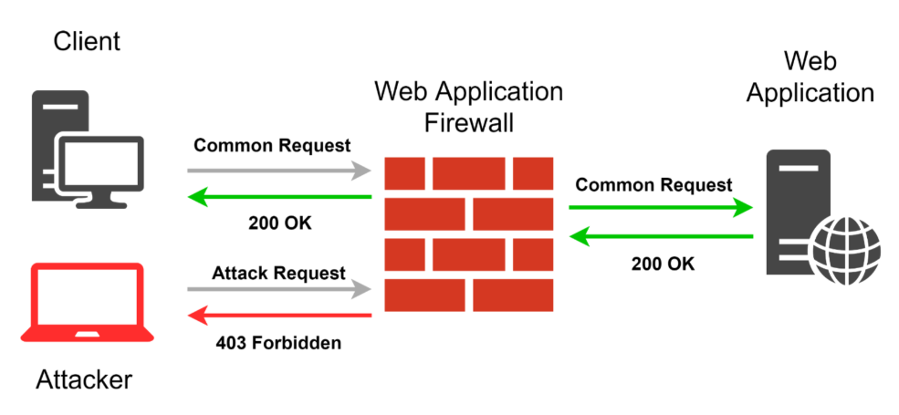
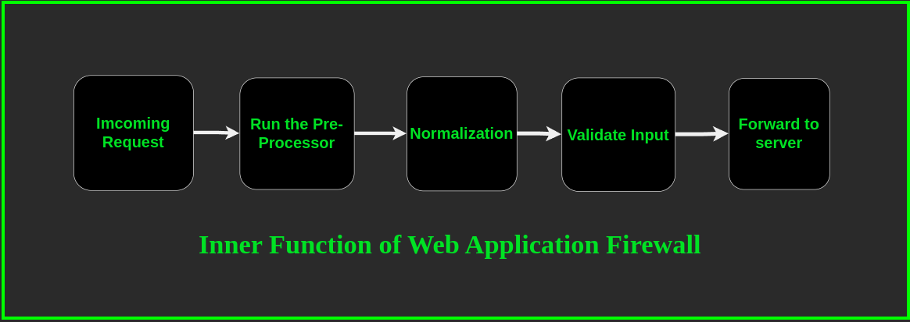

<h1 align="center"> Waf Bypass Theory</h1>

# Introduction to Web Application Firewall

[Photo Credit](https://www.section.io/engineering-education/web-application-firewall-bot-mitigation-comparison/)

#### Web Application Firewall

- A firewall that sit in front of web application and `filter`, `analyze` and `block` all the HTTP traffice pass through and tries to communite with the web server 

- WAF called `reverse proxies`
- `proxy can protect client, reverse proxy can protect server`

#### Two security model of WAF

1. Positive (White List)
    - Allow only traffice that is allowed by WAF and block all the other traffice
2. Negative (Black List)
    - Allow all traffice to pass and only block the traffice filtered by black list

#### WAF Filter Rules

- WAF have some `preset rules`
- If a request matches one of the present rule, the request is block because it is faced as malicious.
-  most of the enterprise WAF solutions, these rules are hidden, and no one can access or see them. This is happening because developers believe that if these rules are hidden, users won’t know them and
neither will attackers, so it protects users from easy bypass techniques

# WAF Fingerprinting

- 1. Passive Fingerprinting
- 2. Active Finterprinting

#### 1. passive Fingerprinting

- Find sings of WAF in `HTTP` response of the web server
- eg. File Header cookie parameter contain (`ns_af=cookie_value`) is the sign of Citrix Netscaler

#### 2. Active Fingerprinting

- send two different URI (`/filepath`) and one has sucessfully retrun the requested matrial and the orther not ==> WAF is present.

## WAF fingerprinting with nmap scritp

`nmap -p80 --script http-waf-detect --script-args="http-waf-detect.aggro " <target>`

- This script can detect numerous IDS, IPS, and WAF products since they often protect web applications in the same
way. But it won’t detect products that don’t alter the HTTP traffic. Results can vary based on product configuration,
but this script has been tested to work against various configurations of the following products

`nmap --script=http-waf-fingerprint <targets>`

## WAF fingerprinting with `WAFW00F`
- Python script that automates WAF fingerprinting and identifies Web Application Firewall (WAF) prod-
ucts.

`wafw00f google.com`

# WAF Function 

#### 1. Pre-Processor 

- Filter every incoming request and decide whether a request will be processed futher or immediately stop.

- Very suspicious request are blocked at this stage

#### 2. Normalization 

- Use verious function 

- Eg functions
    - `hexDecode()` = decodes a hex-encoded string
    - `lowercase()` = converts characters to lower case
    - `urlDecdoe()` = decode a URL-encoded string

#### 3. Input Validation 

- Validate requests using regular expression

- Three security model
    1. Positive security model
    2. Negative Security Model
    3. Hybrid Security Model

